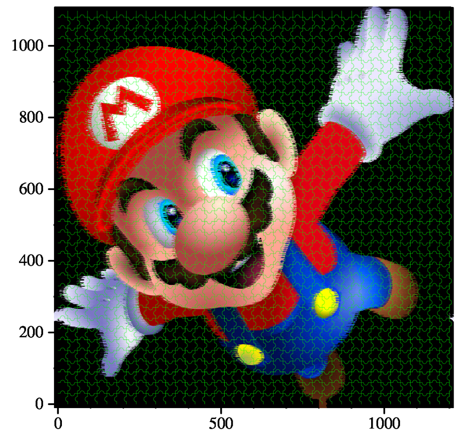

# ToPuzzle
ToPuzzle is application that load an image and draw puzzle lines on it.

# Note
1. This application uses stb_image.h in stb https://github.com/nothings/stb.git when load images. Please read their repository if you need more information. stb_image.h has been included in this repository and you do not need to download it again.
2. ToPuzzle can only generate three channels graphs(red, green, blue), although the input images can have four channels.

# Setup
1. Install jgraph. This application needs to use jgraph package, which can be download from http://web.eecs.utk.edu/~jplank/plank/jgraph/2017-11-28-Jgraph.tar. Please follow the instruction http://web.eecs.utk.edu/~jplank/plank/jgraph/jgraph.html to install the jgraph. Please add the path of jgraph to the PATH environment variable
2. Clone this repository
3. run "make" 

# Use ToPuzzle
./ToPuzzle -i file -o output -r number -c number -d e/h

# Arguments
The following arguments are currently supported:
* -i*  input file
* -o  output file    
* -r  the row number of puzzle
* -c  the col number of puzzle
* -w  the color of the puzzle lines. Should be three fload between 0 and 1. e.g. 0.5 0.1 0.4
* -d  the complexity of the puzzle. There are two opitions. 'e' is easy, 'h' is hard
* -h  print the help page
* --help  print the help page

The arguments with '*' is necessary

# Test
To check whether ToPuzzle is installed successfully, you could run "make check" after install it. "Make check" will run five tests with different arguments. 

Here is an example when you run "./ToPuzzle -d h -i test/test4.png -o test4 -w  0 1 0"
* The input file:

*The output file:

